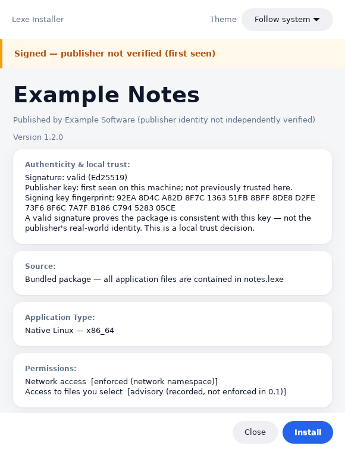
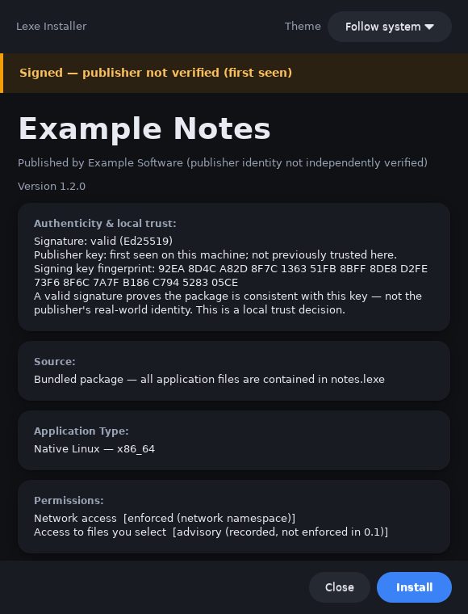
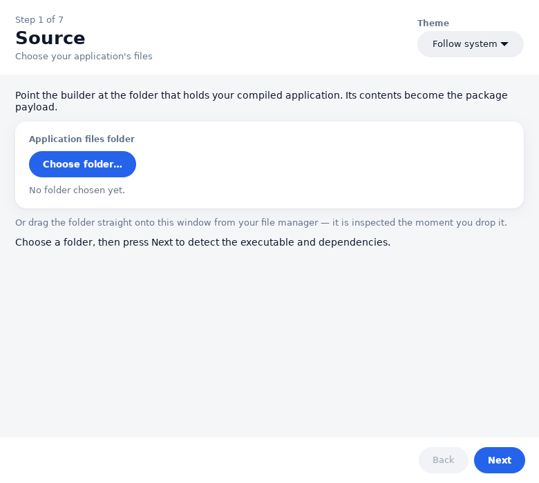
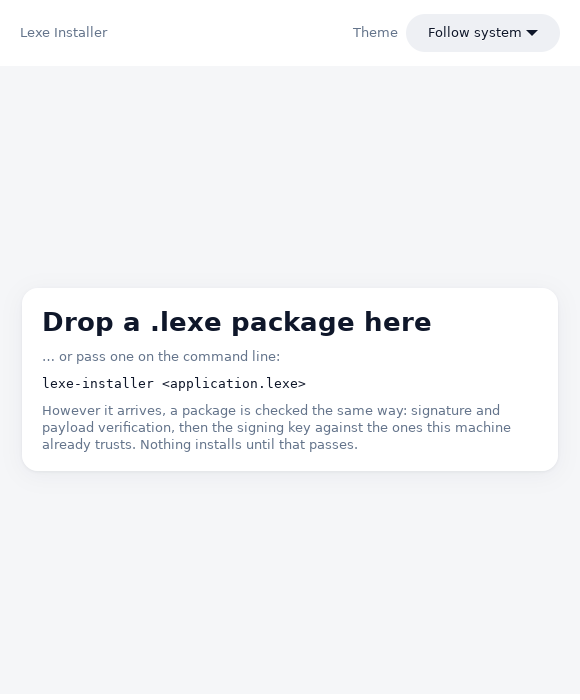

<h1 align="center">.lexe</h1>

<p align="center"><strong>One file. Double-click it. It installs, sandboxed, with no root and no repository.</strong></p>

<p align="center">
  <a href="https://github.com/EeshGarg/.lexe/actions/workflows/ci.yml"></a>
  
  
  
  
</p>

<p align="center">
  
</p>

<p align="center"><em>What you see before anything is installed: who signed it, what it may do, and what the sandbox will enforce.</em></p>

---

## The thing that makes this interesting

A `.lexe` file is one signed, self-describing application. That part is not new.

**This part is:** the payload inside it does not have to be a Linux binary.

<table>
<tr>
<td width="33%" valign="top">

### `native`

A compiled Linux ELF. Verified, sandboxed, launched directly — **nothing** extra
in the execution path.

The boring fast path, and it stays boring on purpose.

</td>
<td width="33%" valign="top">

### `portable`

**The payload is source code.**

The machine that installs it compiles it — behind your explicit approval, inside
the sandbox, with the network **denied**, and the result checked to be a native
executable for *this* machine before anything is promoted.

One file. Native everywhere.

</td>
<td width="33%" valign="top">

### `windows`

A Windows PE.

The manifest must *declare* that it needs a foreign-OS runtime, verification
proves the bytes really are a runnable PE before install, and the resolver picks
Wine or Proton — or refuses honestly if the host has neither.

</td>
</tr>
</table>

All three are implemented, and all three are demonstrated end to end by tests you
can run. A Windows GUI program really opens a window on Linux — through Wine
*and* through Proton — and `tests/acceptance/09_windows_gui.sh` proves it with
`xwininfo` rather than with the runtime's own opinion of itself.

```sh
./scripts/test.sh --all      # every lane. PASS / FAIL / SKIP / BLOCKED.
```

## 60 seconds

```sh
# Build it
cmake -S . -B build -G Ninja -DCMAKE_BUILD_TYPE=RelWithDebInfo
cmake --build build -j"$(nproc)"

# Make a package out of an example, and look at it before trusting it
./build/lexe keygen key.json
./build/lexe build examples/native/cli-hello -o hello.lexe --key key.json
./build/lexe inspect hello.lexe          # identity, signature, permissions, checks

# Install and run it
./build/lexe install hello.lexe
./build/lexe run org.lexe.examples.cli-tool -- 2 9 16
```

`lexe inspect` is the interesting one. It runs the whole verification pipeline and
tells you what each stage concluded, *before* anything is written anywhere.

## What you get

| | |
|---|---|
| **No root.** | Everything installs under `~/.local/share/lexe`. There is no daemon, no setuid binary, and no step that asks for a password. |
| **No repository.** | The file is the distribution channel. Put it on a website, in an email, on a USB stick. |
| **Signatures over exact bytes.** | Ed25519, checked before a single byte of payload is trusted. A tampered package fails at a named stage and says which. |
| **A real sandbox.** | bubblewrap: read-only application image, private data/cache/temp, sanitized environment, network denied unless granted. The launcher **fails closed** — if confinement is expected and unavailable, it refuses rather than running your app unconfined. |
| **Honest language.** | Nothing says "verified", "trusted" or "safe" about a publisher. A valid signature proves the package is intact and that whoever built it held the matching private key. It does not say who they are, and neither do we. |
| **A lifecycle that survives.** | Install, update, roll back, repair, uninstall — transactional, crash-recoverable, and tested by killing the operations halfway through. |

## Where the claims come from

This repository is built around a rule: **if it says something works, there is a
test that demonstrates it.**

```sh
./scripts/test.sh --list
```

| Lane | Proves |
|---|---|
| `--unit` | 692 test cases, 8924 assertions — every subsystem, both GUI view models, and the architecture's own dependency rules |
| `--acceptance` | 10 end-to-end suites against a throwaway install root |
| `--integration` | trust and lifecycle across process boundaries |
| `--gui` | the frontends start, render and exit clean on a display created for the test |
| `--lifecycle` | install → run → update → rollback → repair → uninstall, **and the same with every operation killed halfway** |
| `--security` | hostile packages: traversal, symlink escape, tampered hashes, signature substitution, architecture lies |
| `--windows` | a purpose-built Windows PE, cross-compiled here, actually executed through Wine |
| `--proton` | the same payload through a real Proton installation |
| `--sanitizers` | the whole unit suite again under ASan + UBSan |

Four outcomes, not two. **SKIP** means "deliberately not applicable here".
**BLOCKED** means "this applies, it is expected to work, and this machine cannot
show it" — and a blocked lane is never counted as a pass. What this machine cannot
prove, and what would settle each one, is written down in
**[docs/TESTING.md](docs/TESTING.md) §6**.

The most load-bearing example: the portable type's central claim is that *the same
signed package compiles natively on x86_64 and on AArch64*. It is implemented,
unit-tested, and **has never run on a second ISA.** So that is what the docs say.
Emulation is explicitly not accepted as a substitute.

## Why it is shaped like this

```text
                      lexe
                canonical engine
               /       |        \
            CLI    lexe-ui    lexe-builder
```

**One engine.** `src/lexe/` is the entire implementation — eleven layered
subsystems with a one-way dependency direction, enforced by
`tests/test_architecture.cpp` reading the source tree rather than by a paragraph
asking nicely.

**Three frontends, and none of them reimplements anything.** The CLI is the
engine's own entry point. `lexe-ui` is the consumer frontend and the `.lexe` file
handler. `lexe-builder` is the developer frontend. When two of them needed the same
install-consent logic, the answer was a shared header — not a second copy.

[docs/CAPABILITY-MATRIX.md](docs/CAPABILITY-MATRIX.md) tracks which capability is
reachable from where, and what proves it. Its last column is the point: a row with
an engine implementation, two frontends and an empty proof cell is a claim, not a
capability.

## The CLI

```
$ lexe help

Applications
  open <artifact.lexe>                     open any .lexe: install a package, launch a run.lexe
  install <file.lexe> [--yes] [--trust]    verify and install a package
  run <id> [--chain <c>] [-- <args...>]    launch an installed application (sandboxed)
  compat <id> [--set <chain> | --auto]     show or change how an application is executed
  apps · list · info · inspect             what is installed, and what a package is
  update · rollback · repair · remove      the rest of the lifecycle
  gc <id> [--keep <n>]                     reclaim old versions (keeps active + n)

Developer
  build <project-dir>                      build a signed .lexe from a project folder
  analyze · sdk verify · pack · keygen     dependencies, portability, low-level packing

Trust & verification
  verify <file.lexe> [--json]              run the verification pipeline
  trust show|classes|block|unblock|forget  inspect signer classes, set local trust

System
  runtime [list | show <id>]               compatibility runtimes this host has, and where
  sandbox                                  the isolation backend and every control it enforces
  doctor [--repair] · integrate            check and repair desktop integration
  errors [<id>]                            structured diagnostics for a failed launch
  config · completion · version · help
```

Every command has `--help` with worked examples. `--json` where a script would
want it. Stable exit codes (`0` ok, `2` usage, `3` verification, `4` not found,
`5` consent, `6` busy, `7` local trust). No ANSI escapes when redirected.

Two commands worth knowing about, because they exist to make the runtime
*inspectable* rather than to do anything:

```sh
lexe runtime show proton   # every location searched, in order, and which one won
lexe sandbox               # every isolation control, and its actual state
```

`lexe sandbox` reports per-control rather than as one word, because "sandboxed" is
not a boolean: a host can have a working backend that cannot establish a network
namespace, and saying *which* is the difference between a security claim and a
security fact.

## Screenshots

<table>
<tr>
<td width="50%" valign="top">

<p align="center"><em>Follows your desktop's light/dark preference, and is switchable in place.</em></p>
</td>
<td width="50%" valign="top">

<p align="center"><em><code>lexe-builder</code>: point it at a folder, fill in a few fields, get a signed package. All three payload kinds.</em></p>
</td>
</tr>
<tr>
<td width="50%" valign="top">

<p align="center"><em>Drop a package on the window. Dropping is not a shortcut past any check.</em></p>
</td>
<td width="50%" valign="top">

**Not pictured, because a screenshot would prove nothing:** a Windows GUI program
running on Linux under the sandbox, with its window witnessed by `xwininfo` on a
display created for the test.

That one is
[`tests/acceptance/09_windows_gui.sh`](tests/acceptance/09_windows_gui.sh), and it
runs the whole thing twice — once through Wine, once through Proton.

</td>
</tr>
</table>

## What works today

Only implemented, tested capabilities. The **Proof** column is what you run.

| Area | What works | Proof |
|---|---|---|
| **Three payload kinds** | native ELF, portable source compiled on install, Windows PE through Wine or Proton | acceptance 01, 05, 06, 07, 09 |
| **Verification** | Ed25519 over exact bytes; a hardened parser (zip-slip, decompression limits, duplicate and case-colliding entries, over-long components); the `payload-role` stage, which proves a native package's entrypoint really is a runnable ELF and a Windows package's really is a runnable PE | `--security`, `test_verify`, `test_hostile_packages` |
| **Isolation** | bubblewrap; read-only image; private data/cache/temp; allowlisted environment; network denied unless granted; display access **only** for a declared GUI launch mode; fails closed | `test_isolation_linux`, `test_security_boundary`, acceptance 08 |
| **Lifecycle** | transactional install with crash recovery, atomic version activation, update, rollback, repair, three uninstall modes, lease-aware GC, race-safe locking | `--lifecycle`, `--integration` |
| **Torture** | every operation killed halfway; corrupted, deleted and unreadable payloads; an update while the app runs; a lease whose holder was killed — all held to one invariant: **either the previous valid state or the new one, never an ambiguous half-applied one** | `--lifecycle` |
| **Trust** | local trust-on-first-use, key pinning, changed-key refusal, block/unblock/forget; signer classes; language that never overstates | `test_trust*`, `--security` |
| **Portable code** | explicit compile approval that `--yes` never implies; an unprivileged, network-denied build inside the sandbox; host-ISA verification of the output before promotion; a `build.json` attestation the launcher checks on every run; repair that **rebuilds** rather than copying an untrusted binary | acceptance 05, `test_hostbuild` |
| **Desktop integration** | durable, hash-recorded registration that `lexe doctor --repair` re-establishes **from installed state with no package present**; `.desktop` entries, icons, MIME, and the persistent handler | acceptance 02, `--lifecycle` |
| **Diagnostics** | structured `.lexe-error` records with the failure stage, chain, host facts, exit code **or signal**, and captured output | acceptance 03 |
| **Portability** | the frozen **Tux32 Core 1** baseline; `lexe sdk verify` with typed verdicts, reusing the one dependency engine; a cross-distribution proof in CI | `test_tux32*`, CI |
| **Services** | `launch.mode: "service"` detaches by declaration, is supervised, holds a version lease, and stops cleanly and distinguishably from being killed | `--lifecycle` (03) |

## What does not work

Kept as prominent as the list above, on purpose.

| | |
|---|---|
| **Portable code on a second ISA** | The central claim of the `portable` type. Implemented and unit-tested; **never run on AArch64.** The test that would settle it is written down in [docs/TESTING.md](docs/TESTING.md) §7. |
| **ISA translation chains** | `fex`, `box64`, `qemu-user` and the layered forms are vocabulary the resolver understands and nothing has ever executed. Needs a host where the translation is real. |
| **The reboot boundary** | That integration survives a reboot, and that double-clicking a `.lexe` in a file manager opens it, need a real desktop session. [tests/acceptance/REBOOT.md](tests/acceptance/REBOOT.md). |
| **Session-manager integration** | A `.LEXE` service is not a systemd unit. This is a *missing feature*, not a missing machine — see [docs/ROADMAP.md](docs/ROADMAP.md) §4, which explains why it is a design question first. |
| **Isolation on Windows** | Windows is a build and unit-test host. There is no containment there, and the runtime says so rather than pretending. |
| **Trust beyond your own machine** | Local trust-on-first-use only. No global revocation, no authenticated key rotation, no publisher identity. |

Not production-ready. The **[Alpha support contract](docs/ALPHA.md)** states
exactly what is and is not claimed.

## Install the runtime

```sh
git clone https://github.com/EeshGarg/.lexe.git && cd .lexe
cmake -S . -B build -G Ninja -DCMAKE_BUILD_TYPE=Release
cmake --build build -j"$(nproc)"
sudo ./packaging/install.sh          # or: ./packaging/install.sh --user
```

`packaging/install.sh` calls `lexe integrate` rather than hand-rolling MIME
registration, because there is exactly one implementation of desktop registration
and this is not it.

**Needs:** a C++20 compiler, CMake 3.22+, `bubblewrap` (for isolation — without it
the launcher refuses rather than running unconfined), and `libgtk-3-dev` for the
graphical frontends. [docs/TESTING.md](docs/TESTING.md) §4 has the full list and
what each package buys you.

## Documentation

Full index and reading order: **[docs/README.md](docs/README.md)**.

**Start here**

| Document | What it covers |
|---|---|
| [docs/TUTORIAL.md](docs/TUTORIAL.md) | Package and run your first application |
| [docs/TESTING.md](docs/TESTING.md) | How to validate any of this — the lanes, the environment, and what this machine cannot prove |
| [docs/CAPABILITY-MATRIX.md](docs/CAPABILITY-MATRIX.md) | Every capability, which tool reaches it, and what proves it |
| [examples/](examples/) | Small real applications, grouped by payload kind. They double as documentation |

**The specification**

| Document | What it covers |
|---|---|
| [docs/FORMAT-0.1.md](docs/FORMAT-0.1.md) | The normative container and manifest specification |
| [docs/DEFINITIVE-ARCHITECTURE.md](docs/DEFINITIVE-ARCHITECTURE.md) | What the runtime does — and §15, what it does not |
| [docs/TRUST-MODEL.md](docs/TRUST-MODEL.md) | What a signature proves, and what it does not |
| [docs/ISOLATION.md](docs/ISOLATION.md) | The sandbox, including what display access costs |
| [docs/TUX32.md](docs/TUX32.md) | The Tux32 Core 1 portability baseline |

**Building on it**

| Document | What it covers |
|---|---|
| [docs/ARCHITECTURE.md](docs/ARCHITECTURE.md) | The module map, the layering, and the build |
| [docs/IMPLEMENTERS.md](docs/IMPLEMENTERS.md) | Writing a conforming runtime of your own |
| [docs/HARDENING.md](docs/HARDENING.md) | The security posture, control by control |
| [docs/ROADMAP.md](docs/ROADMAP.md) | What is not done, in priority order, with entry points |

## Roadmap

| Stage | Focus |
|---|---|
| **Alpha** *(here)* | The foundations — format, crypto, install and lifecycle, isolation, concurrency, trust — the three payload kinds, and Tux32 Core 1 cross-distribution portability. |
| **Beta** | Real AArch64, so the portable type's central claim stops being designed-and-unproven. A wider tested runtime matrix. Additional Tux32 baselines and automated sysroot provisioning. The repository (Tier 2) trust tier. |
| **1.0** | Root accreditation (Tier 3) trust. A conformance suite and certification for third-party runtimes. |

No dates. [docs/ALPHA.md](docs/ALPHA.md) is the current contract.

## Contributing

**[CONTRIBUTING.md](CONTRIBUTING.md)** takes you from a fresh clone to a green test
run. In short:

```sh
./scripts/test.sh --all
```

One rule worth reading before you open a pull request: **a defect is not fixed
until a test reproduces it.** Understand the root cause, correct it, write a test
that fails against the old behaviour, watch it pass against the new one, and
confirm the broader suite is still green. A fix without that fourth step is an
assertion.

Bug reports, feature requests and portability reports have
[issue templates](.github/ISSUE_TEMPLATE). **Security findings go privately**
through the Security tab — **[SECURITY.md](SECURITY.md)** has the channel, the
scope, and the documented non-guarantees that are *not* vulnerabilities.

## License

**Proprietary during the pre-release phase**, while the signing and trust
infrastructure is established — see [LICENSE](LICENSE). The stated intent is to
relicense under the **GPL** once that foundation is in place. The specification
itself is language-neutral, so conforming third-party runtimes may be implemented
independently. Revisions published before the relicense remain under their
original Apache-2.0 terms.
